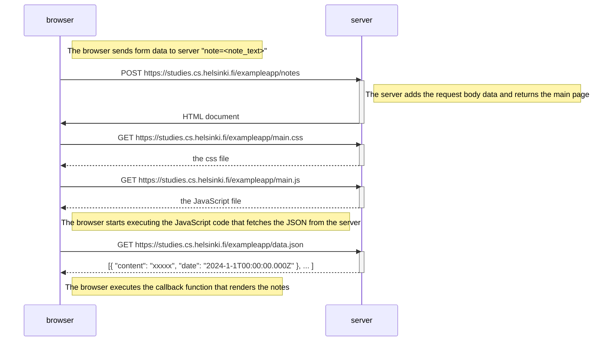

# Send new note

```mermaid
sequenceDiagram;
    participant browser
    participant server

    Note right of browser: The browser sends form data to server "note=<note_text>"

    browser->>server: POST https://studies.cs.helsinki.fi/exampleapp/notes
    activate server

    Note right of server: The server adds the request body data and returns the main page

    server->>browser: HTML document
    deactivate server

    browser->>server: GET https://studies.cs.helsinki.fi/exampleapp/main.css
    activate server
    server-->>browser: the css file
    deactivate server

    browser->>server: GET https://studies.cs.helsinki.fi/exampleapp/main.js
    activate server
    server-->>browser: the JavaScript file
    deactivate server

    Note right of browser: The browser starts executing the JavaScript code that fetches the JSON from the server

    browser->>server: GET https://studies.cs.helsinki.fi/exampleapp/data.json
    activate server
    server-->>browser: [{ "content": "xxxxx", "date": "2024-1-1T00:00:00.000Z" }, ... ]
    deactivate server

    Note right of browser: The browser executes the callback function that renders the notes
```
