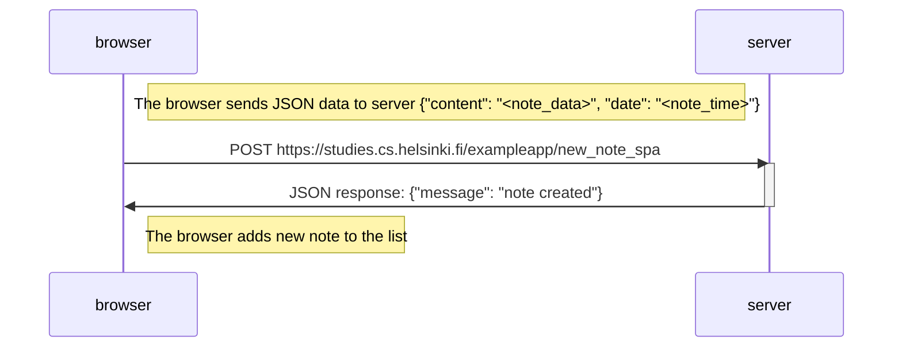

# Single Page Application send new note

```mermaid
sequenceDiagram;
    participant browser
    participant server

    Note right of browser: The browser sends JSON data to server {"content": "<note_data>", "date": "<note_time>"}

    browser->>server: POST https://studies.cs.helsinki.fi/exampleapp/new_note_spa
    activate server
    server->>browser: JSON response: {"message": "note created"}
    deactivate server

    Note right of browser: The browser adds new note to the list
```
